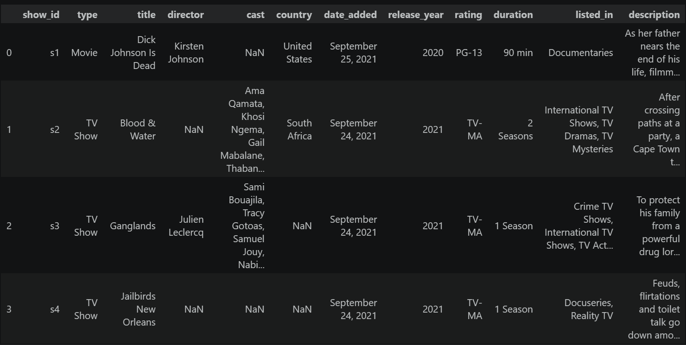
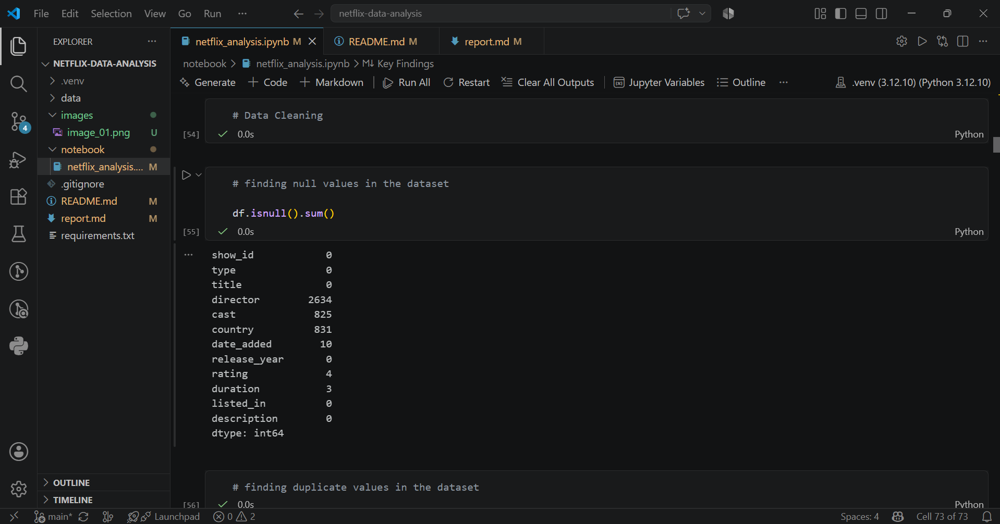
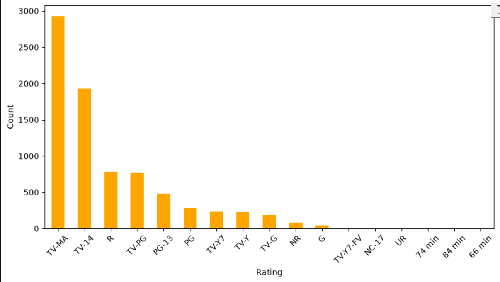

# 📺 Netflix Data Analysis using Pandas

## Project Overview

This project explores the Netflix Titles dataset using Python and Pandas.

The goal is to clean the dataset, perform exploratory data analysis (EDA), and answer business-related questions about Netflix's content library.

---

## Dataset

- Source: Kaggle
- Rows: 8,807
- Columns: 12

---

## Technologies Used

- Python
- Pandas
- Jupyter Notebook

---

## Project Workflow

1. Import Libraries
2. Load Dataset
3. Understand Dataset
4. Data Cleaning
5. Exploratory Data Analysis (EDA)
6. Business Questions
7. Conclusions

---

## Business Questions Answered

- Which country has the highest Netflix content?
- Does Netflix have more Movies or TV Shows?
- Which release year has the highest number of titles?
- Which rating is most common?
- Which genre appears the most?
- Who is the most frequent director?
- Which actors appear most often on Netflix?

---

## Key Findings

- United States has the highest number of Netflix titles.
- Netflix contains significantly more Movies than TV Shows.
- International Movies is the most common genre.
- TV-MA is the most frequent content rating.
- Rajiv Chilaka is the most prolific director.
- Anupam Kher appears in the highest number of Netflix titles.

---

## Future Improvements

- Add data visualizations using Matplotlib and Seaborn.
- Build an interactive dashboard.
- Perform advanced statistical analysis.

---

## Project Screenshots

## Author

**Sumit S. Shastri**